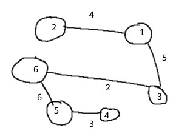
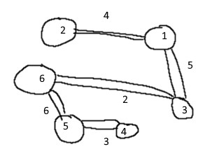
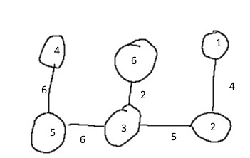
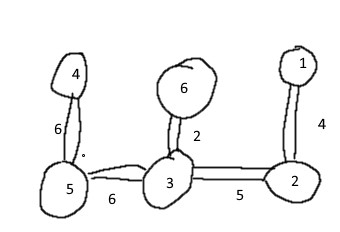
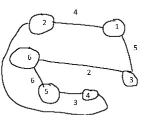

# Compulsary 2

## Problem 1

### a)
1-5 = 11
1-2-5 = 4+7 = 11
1-3-5 = 4+7 = 11
1-3-5 = 10 + 3 = 13
1-6-5 = 7 + 6 = 13

### b)

* 1-2 = 4
* 2-4 = 6
* 4-5 = 3
* 5-3 = 6
* 3-6 = 2
* Sum = 21

### c)

**Tree 1**

* finding minimal spanning tree

* Double the edges

* Eulerian tour

1-2-1-3-6-5-4-5-6-3-1

* Shortcut

1-2-3-3-6-5-4-1

**Tree 2**

* finding minimal spanning tree

* Double the edges

* Eulerian tour

1-2-1-3-6-3-5-4-5-3-1

* Shortcut

1-2-3-6-5-4-1

**PS I see I have made a mistake here that follow through into task d, I have mixed node 1 and 2 in the drawing, but the text outside of the picture should be correct**

### d)

* minimum matching perfect connectin 2 and 4

* Eulerian tour
1-2-4-5-6-3-1

* minimum matching perfect connecting 2 and 6

* Eulerian tour
1-2-4-5-3-6-3-1

## Problem 2

### a)

A(1) = {(0,0), (3,5)}

A(2) = {(0,0), (3,5), (2,3), (5,8)}

A(3) = {(0,0), (3,5), (2,3), (5,8), ~~(2,2)~~, ~~(5,7)~~, ~~(4,5)~~, (7,10)}

A(3) = {(0,0), (3,5), (2,3), (5,8), (7,10)}

A(4) = {(0,0), (3,5), (2,3), (5,8), (7,10), ~~(4, 5)~~, ~~(7, 10)~~, ~~(6, 8)~~, (9, 13)}

A(4) = {(0,0), (3,5), (2,3), (5,8), (7,10), (9, 13)}

A(5) = {(0,0), (3,5), (2,3), (5,8), (7,10), (9, 13), ~~(3, 4)~~, (6, 9), ~~(5, 7)~~, (8, 12), (10, 14)}

A(5) = {(0,0), (3,5), (2,3), (5,8), (7,10), (9, 13), (6, 9), (8, 12), (10, 14)}

A(6) = {(0,0), (3,5), (2,3), (5,8), ~~(7,10)~~, ~~(9, 13)~~, ~~(6, 9)~~, (8, 12), ~~(10, 14)~~, (1, 2), (4, 7), ~~(3, 5)~~, (6, 10), ~~(8, 12)~~, (10, 15), (7, 11), (9, 14)}

A(6) = {(0,0), (3,5), (2,3), (5,8), (8, 12), (1, 2), (4, 7), (6, 10), (10, 15), (7, 11), (9, 14)}

### b)

The maximum number of elements would be B+1, if there would be more there would be sets worth less that has not been removed.

### c)

The maximum of elements in this case would usually be 
vmax + vmax-1

## Problem 3

NB: This is preemptive and the task is preemptive
Job 4 + Job 3 + Job 6 + Job 2 + Job 5 + Job 1 + Job 7 = 3 + 5 + 7 + 11 + 15 + 21 + 23 = 85

Job 2 + Job 4 + Job 6 + Job 3 + Job 5 + Job 1 + Job 7 = 5 + 6 + 8 + 11 + 15 + 21 + 23 = 89

## Problem 4

### a) 
Implement the randomized algorithm for MAX SAT where we set each Xi to true independently with probability 1/2 (it is very simple)

se java fil i src
### b)

x1 = False

C1 True = 3 * 3/4

C1 False = 3 * 1

C2 True = 2 * 1

C2 False = 2 * 1/2

C3 True = 1 * 1

C3 False = 1 * 3/4

C4 True = 3 * 1/2

C4 False = 3 * 1

x2 = True

C5 True = 4 * 1

C5 False = 4 * 1/2

C6 True = 2 * 1/2

C6 False = 2 * 1

x3=False

C2 True = 2 * 1/2

C2 False = 2 * 1

C7 True = 2 * 1

C7 False = 2 * 1/2

x4=False

C3 True = 1 * 1

C3 False = 1 * 1/2

C7 True = 0

C7 False = 2 * 1

C8 True = 3 * 3/4

C8 False = 3 * 1

x5=True

C3 True = 1 * 0

C3 False = 1 * 1

C6 True = 2 * 1

C6 False = 2 * 0

C9 True = 5 * 1

C9 False = 5 * 1/2

## Problem 5

We have the following MAX SAT problem

C1 = 4(x1 V &not;x3), C2 = 3(&not;x1 V x4), C3 = 2(&not; x2 V x4),C4 = 1(&not;x2 V &not; x3 V x4)
)

### a)

• maximize 4𝑧1 + 3𝑧2 + 2𝑧3 + 𝑧4

• subject to

• 𝑦1 ≥ 𝑧1 → 𝑦1 − 𝑧1 ≥ 0

• 𝑦2 + 1 − 𝑦1 ≥ 𝑧2 → −𝑦1 + 𝑦2 − 𝑧2 ≥ −1

• 𝑦3 + 1 − 𝑦1 ≥ 𝑧3 → −𝑦1 + 𝑦3 − 𝑧3 ≥ −1

• (1 − 𝑦2) + 1 − 𝑦3 ≥ 𝑧4 → −𝑦2 − 𝑦3−𝑧4 ≥ −2

• 𝑦𝑖 ∈ 0,1 , 𝑖 = 1, 2, 3

• 𝑧𝑗 ∈ 0,1 ,𝑗 = 1, … , 4

### b) 

• maximize 4𝑧1 + 3𝑧2 + 2𝑧3 + 𝑧4

• subject to

• −𝑦1 + 𝑦2 − 𝑧2 ≥ −1

• −𝑦1 + 𝑦3 − 𝑧3 ≥ −1

• −𝑦2 − 𝑦3−𝑧4 ≥ −2

• 0 <= 𝑦𝑖 <= 1 , 𝑖 = 1, 2, 3

• 0 <= 𝑧𝑗 <= 1 , 𝑗 = 1, … , 4

