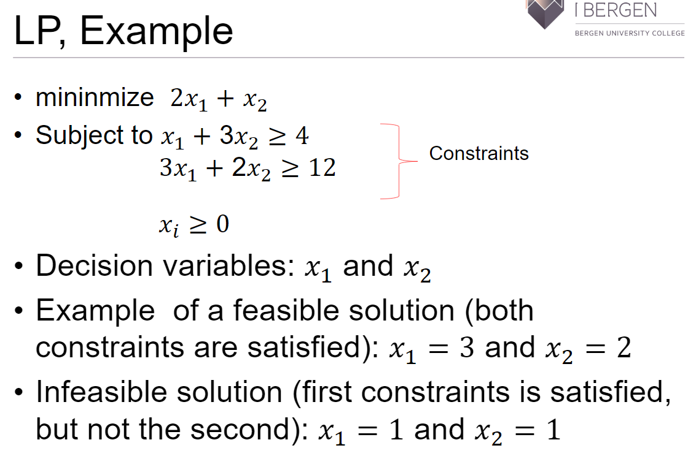

# Algoritmeoppgaver som kan komme på eksamen

## Pattern matching
### Brute Force
### Boyer-Moore
### Knuth-Morris-Pratt
## Tries
## Huffman coding
## Traveling salesperson
### Double Tree Algorithm
### Christofides' Algorithm
## Minimizing the Sum of Completion Times on a single machine (Chapter 4.1)
## MAX SAT
### Randomized Algorithm
### Derandomization
## Formulate ILP, LP and Dual given an instance of
### Set cover
#### Linear Programming
* Plays a central role in design and analysis of approximation algorithms
* Important Terms
    * **Decision variables**: represent some sort of decisions that need to be made
    * **Constraints**: Variables are constrained by a number of linear inequalities  
    * **Feasible solutions**: Any assignment of real numbers to the variables such that the constraints are satisfied
* Exists efficient algorithms to solve LP 
* Example

#### Integer Programming
* Integer linear programming
    * Exclude fractional solutions
* Zero-One linear programming
    * Allow only 1 and 0 as values for decision variables
* Integer Programming as NP-Hard 
### Vertex cover
## Coloring Graphs(vertices)
### 2 coloring algorithm
### (delta+1) coloring algorithm
### the O(sqrt(n)) given Chapter 6.5 (and also in Compulsory 2)

